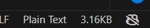

# File Size on Toolbar

A VS Code Extension to display text file sizes on the toolbar below because I am fed-up of VS Code not including it in the main app.

## Features

1. Fast and snappy file size display on the toolbar
2. No configuration required. It just _works_.
3. Live file size for Untitled files
4. Updates file size display on save for named files.
5. Runs on start-up.

For example if there is an image subfolder under your extension project workspace:

> This extension does not work with images, binaries, blobs and other file types. Support may come in the future. [Open a PR if you want it sooner](https://github.com/cliff-4/VSC-file-size-on-toolbar).

## Requirements

1. For development, run `npm install` to install the node modules.
2. For Debugging, go to Debug panel and `Run Extension` to start a VS Code debugging session with the extension.

## Extension Settings

None as of yet. It a simple application lol.

## Known Issues

-   Does not work against non-text files
-   Events are called too frequently for Untitled files.

## Release Notes

Will add more as I progress through it more.

### 1.0.1

Added Extension Icon

### 1.0.0

Release!

1. Shows size for text files in human readable units.
